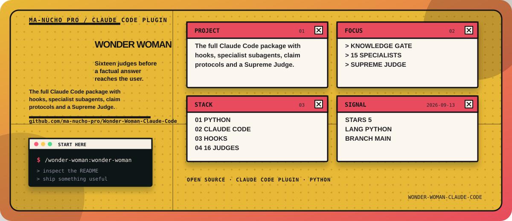

<!-- manucho-readme-banner:start -->
<p align="center">
  
</p>
<!-- manucho-readme-banner:end -->

<p align="center">
  
</p>

<div align="center">

# Wonder Woman for Claude Code

### Make Claude prove it before it says it.

**A 16-judge, multi-agent verification plugin for Claude Code.**  
Wonder Woman researches, challenges, cross-checks, falsifies, and re-verifies factual answers **before they reach the user**.

**Created by [ARKEA AI](https://github.com/ma-nucho-pro) — Roberto Manuel Jara Peche**  
[GitHub](https://github.com/ma-nucho-pro) · [Instagram](https://www.instagram.com/robertmanuchojp/) · [YouTube](https://www.youtube.com/@ManuchoAI) · [LinkedIn](https://www.linkedin.com/in/roberto-manuel-jara-peche-10867240b/)

[](https://code.claude.com/docs/en/plugins)
[](#the-16-judge-tribunal)
[](#how-it-works)
[](#core-rules)
[](LICENSE)

**[Download ZIP](https://github.com/ma-nucho-pro/Wonder-Woman-Claude-Code/archive/refs/heads/main.zip)** ·
**[Releases](https://github.com/ma-nucho-pro/Wonder-Woman-Claude-Code/releases)** ·
**[Install](#install-in-60-seconds)** ·
**[Verify](#verify-that-it-loaded)** ·
**[16 Judges](#the-16-judge-tribunal)** ·
**[Español](README.es.md)**

</div>

---

## What this repository is

This repository is the **Claude Code FULL distribution** of Wonder Woman.

It is not just a single prompt or `SKILL.md`. The plugin ships:

- a verification skill;
- a session bootstrap hook;
- **20 Claude Code subagent definitions**;
- **15 specialist first-stage judges**;
- **1 Supreme Judge**;
- a Knowledge Gate, Resource Scout, Researcher, and Corrector;
- claim-ledger, source-policy, citation, reproducibility, and verification-loop protocols;
- structured verdict schemas and adversarial evals.

The parent Claude Code session coordinates the process. Specialist agents receive isolated delegated tasks, and the Supreme Judge sees the evidence and judge verdicts only after the first-stage review is complete.

> **Important:** Wonder Woman is designed to reduce unsupported factual claims. It does **not** claim that any LLM can be made 100% incapable of error.

---

## The problem

AI can be wrong while sounding completely certain.

A model can:

- invent a source, URL, API, study, number, or quote;
- accept a false premise from the user;
- rely on stale software documentation;
- cite a page that does not actually support the claim;
- make a plausible calculation error;
- confuse an inference with a verified fact;
- repeat another agent's mistake and treat consensus as proof.

A normal “be honest” prompt still leaves one model grading its own homework.

Wonder Woman treats every material factual answer as an **untrusted draft** until it survives evidence-based review.

```text
No evidence?      → do not present the claim as fact.
No real source?   → do not fabricate one.
Sources conflict? → expose the conflict.
A judge objects?  → investigate the objection.
Still uncertain?  → say "I cannot confirm this."
```

---

## How it works

```text
USER QUESTION
      │
      ▼
Knowledge Gate ───────→ What must be known? What is missing?
      │
      ▼
Resource Scout ───────→ Find the strongest evidence targets
      │
      ▼
Researcher(s) ────────→ Open real sources and build evidence
      │
      ▼
PRIVATE DRAFT          → Never released directly
      │
      ▼
CLAIM LEDGER           → Split the draft into auditable claims
      │
      ▼
┌──────────────────────────────────────────────┐
│ 15 independent specialist judges            │
│ evidence · sources · freshness · citations  │
│ hallucinations · falsification · logic      │
│ assumptions · contradictions · numbers      │
│ context/tools · blind whole-answer review   │
└──────────────────────┬───────────────────────┘
                       ▼
              JUDGE 16 — SUPREME JUDGE
                       │
                ┌──────┴──────┐
                │             │
              PASS           FAIL
                │             │
                ▼             ▼
              USER      RESEARCH → CORRECT
                              │
                              ▼
                         FRESH JUDGES
                              │
                              └────────↻
```

A failed draft is not merely given a warning and released. It goes back through targeted research, correction, and fresh review. The default verification budget is five adjudicated rounds. The limit **never forces a PASS**.

---

# Install in 60 seconds

## Option 1 — Clone the repository (recommended)

Prerequisites: **Claude Code installed and authenticated**, plus Git.

### macOS / Linux / Windows Terminal

```bash
git clone https://github.com/ma-nucho-pro/Wonder-Woman-Claude-Code.git
cd Wonder-Woman-Claude-Code
claude plugin validate .
claude --plugin-dir .
```

Claude Code will start with Wonder Woman loaded for that session.

### Windows PowerShell / CMD

```powershell
git clone https://github.com/ma-nucho-pro/Wonder-Woman-Claude-Code.git
cd Wonder-Woman-Claude-Code
claude plugin validate .
claude --plugin-dir .
```

---

## Option 2 — Download the repository as ZIP

1. Click **[Download ZIP](https://github.com/ma-nucho-pro/Wonder-Woman-Claude-Code/archive/refs/heads/main.zip)**.
2. Extract `Wonder-Woman-Claude-Code-main.zip`.
3. Open a terminal inside the extracted `Wonder-Woman-Claude-Code-main` folder.
4. Run:

```bash
claude plugin validate .
claude --plugin-dir .
```

---

## Option 3 — Use the packaged plugin ZIP

If you download `wonder-woman-claude-code-plugin-v0.3.0.zip` from the **[Releases](https://github.com/ma-nucho-pro/Wonder-Woman-Claude-Code/releases)** page, Claude Code can load the ZIP directly without extracting it:

### macOS / Linux

```bash
claude --plugin-dir ./wonder-woman-claude-code-plugin-v0.3.0.zip
```

### Windows PowerShell / CMD

```powershell
claude --plugin-dir ".\wonder-woman-claude-code-plugin-v0.3.0.zip"
```

Claude Code officially supports loading a plugin directory or a plugin `.zip` through `--plugin-dir`.

> `--plugin-dir` loads the plugin for that Claude Code session. Marketplace installation is a separate distribution path.

---

## Verify that it loaded

Once Claude Code opens:

1. Run `/context` and look under **Custom Agents**.
2. Confirm that the Wonder Woman agents are listed.
3. If you changed files while Claude Code is open, run `/reload-plugins`.
4. To force the verification workflow manually, invoke:

```text
/wonder-woman:wonder-woman
```

The plugin also includes a `SessionStart` hook that injects the Wonder Woman verification bootstrap when the plugin loads.

### What you should see

The plugin defines **20 custom agents**:

- 4 workflow agents: Knowledge Gate, Resource Scout, Researcher, Corrector;
- Judges 01–15;
- Judge 16, the Supreme Judge.

A FULL review is intended to use isolated subagent calls rather than one context pretending to be sixteen reviewers.

---

## Quick test

After loading the plugin, ask Claude Code something that requires verification, for example:

```text
Use Wonder Woman FULL verification before answering.
Do not rely on model memory.
Check whether the API/function I named actually exists, verify it against authoritative documentation, and only then answer.
```

For a stronger test, intentionally include a questionable premise or a fake-looking API name and inspect whether Wonder Woman challenges it instead of confidently accepting it.

---

## The 16-judge tribunal

| # | Judge | What it attacks |
|---:|---|---|
| 01 | **Knowledge Examiner** | False certainty and unsupported model-memory claims |
| 02 | **Premise Auditor** | False, ambiguous, incomplete, or contradictory premises |
| 03 | **Evidence Prosecutor** | Claims without evidence that proves their actual scope |
| 04 | **Source Authority Auditor** | Weak, biased, stale, or unsuitable sources |
| 05 | **Primary Source Hunter** | Missed official, original, or direct evidence |
| 06 | **Freshness Inspector** | Outdated versions, prices, laws, APIs, schedules, statistics |
| 07 | **Citation Entailment Inspector** | Sources that do not actually support the cited claim |
| 08 | **Hallucination Hunter** | Invented names, studies, URLs, APIs, quotes, numbers, tool results |
| 09 | **Falsification Agent** | Counterexamples and evidence that can disprove the draft |
| 10 | **Logic Auditor** | Invalid reasoning, causal leaps, and unsupported conclusions |
| 11 | **Assumption Hunter** | Gaps silently filled by the model and hidden assumptions |
| 12 | **Contradiction Hunter** | Internal contradictions and conflicts with evidence |
| 13 | **Numerical Auditor** | Math, percentages, units, totals, rounding, statistics |
| 14 | **Context & Tool Auditor** | Misread files, tool failures, invented outputs, missing context |
| 15 | **Independent Blind Reviewer** | Fresh end-to-end review without seeing other verdicts |
| 16 | **Supreme Judge** | Evidence-based release decision: PASS / FAIL / CLARIFY / SAFE_ABSTENTION |

---

## Core rules

```text
NO MATERIAL FACTUAL CLAIM MAY REACH THE USER
UNTIL IT SURVIVES INDEPENDENT, ADVERSARIAL,
EVIDENCE-BASED VERIFICATION.

CONSENSUS IS NOT EVIDENCE.
CONFIDENCE IS NOT EVIDENCE.
MODEL MEMORY ALONE IS NOT PRIMARY EVIDENCE.
NEVER FORCE A PASS.
```

Wonder Woman prefers:

**evidence > confidence**  
**primary sources > model memory**  
**fresh verification > stale recall**  
**correction > forced completion**  
**honest uncertainty > fabrication**

---

## Evidence hierarchy

Wonder Woman prefers evidence roughly in this order:

1. Direct evidence: execution results, original user data, primary documents, authoritative databases.
2. Primary/official sources: official documentation, original research, primary legal text, first-party records.
3. Strong independent secondary sources: reputable reporting, systematic reviews, established references.
4. Supporting sources: expert commentary, community documentation, forums with corroboration.
5. **Not evidence by itself:** model memory, another agent's opinion, confidence, majority vote, unopened search snippets.

A failed tool call means **UNVERIFIED**, not **FALSE**. An empty search means **not found in this search**, not **does not exist**.

---

## Research reproducibility

Wonder Woman's research protocol asks reviewers to:

1. formulate the exact evidence question;
2. choose the right source classes;
3. apply date/version/jurisdiction/scope filters;
4. detect duplicate or dependent sources;
5. search for independent and contrary evidence;
6. rank the final evidence set.

That helps prevent ten articles repeating one press release from being treated as ten independent confirmations.

---

## Updating

If you installed from Git:

```bash
git pull
claude plugin validate .
claude --plugin-dir .
```

If you use the release ZIP, download the newest release and launch Claude Code with the new archive.

---

## Troubleshooting

### Plugin validation fails

Run:

```bash
claude plugin validate .
```

Then fix the reported path or manifest issue before launching.

### Agents do not appear

Inside Claude Code:

```text
/reload-plugins
/context
```

Check **Custom Agents**. You can also open `/plugin` and inspect the **Errors** tab.

### Need deeper diagnostics

Launch Claude Code with debug logging:

```bash
claude --debug --plugin-dir .
```

### Wonder Woman says FULL mode did not run

That is deliberate. The system is forbidden from claiming that 16 independent judges ran unless the host actually dispatched independent subagent calls.

---

## Repository structure

```text
Wonder-Woman-Claude-Code/
├── .claude-plugin/
│   └── plugin.json
├── agents/                 # 20 Claude Code custom agents
├── skills/
│   ├── wonder-woman/
│   └── using-wonder-woman/
├── hooks/
├── scripts/
├── tests/
├── assets/
├── README.md
└── INSTALL.md
```

Claude Code expects plugin components such as `agents/`, `skills/`, and `hooks/` at the plugin root. Only `plugin.json` belongs inside `.claude-plugin/`.

---

## Portable Claude / ChatGPT Skill

This repository is specifically for the **Claude Code FULL plugin**.

If you want the portable Agent Skill distribution for environments such as Claude custom Skills or ChatGPT Skills where available, use the main Wonder Woman repository instead:

**https://github.com/ma-nucho-pro/Wonder-Woman**

Do not upload this entire Claude Code plugin ZIP as a normal Claude/ChatGPT Skill package.

---

## FAQ

### Does Wonder Woman guarantee that Claude will never be wrong?

No. No prompt or multi-agent workflow can honestly guarantee zero model errors. Wonder Woman is designed to make unsupported claims harder to release, force stronger verification, and prefer explicit uncertainty over fabrication.

### Are the 16 judges just sixteen copies of the same prompt?

No. Each judge attacks a distinct failure mode. The system also includes an independent blind reviewer and a Supreme Judge that adjudicates evidence rather than majority vote.

### Does a 15–1 vote automatically pass?

No. **Consensus is not evidence.** One well-supported contradiction can block the answer.

### What happens when verification fails?

The draft returns to research and correction, then fresh reviewers evaluate it again. If the evidence still cannot support the claim after the verification budget is exhausted, the claim must be removed, qualified, disputed, clarified, or answered with an honest inability to confirm.

### Is this the same ZIP I upload to claude.ai Skills or ChatGPT Skills?

No. This is the Claude Code FULL plugin. Use the portable Wonder Woman Skill distribution from the main repository for normal Skill upload interfaces.

---

## Creator, license, and credits

**Wonder Woman for Claude Code was created by ARKEA AI and Roberto Manuel Jara Peche.**

- Creator: **Roberto Manuel Jara Peche**
- Organization: **ARKEA AI**
- GitHub: https://github.com/ma-nucho-pro
- Instagram: https://www.instagram.com/robertmanuchojp/
- YouTube: https://www.youtube.com/@ManuchoAI
- LinkedIn: https://www.linkedin.com/in/roberto-manuel-jara-peche-10867240b/

Wonder Woman is open-source software licensed under the **Apache License 2.0**. You may use, modify, and redistribute the project under the terms of that license, including commercial use. Redistributions must preserve the applicable license, copyright, and attribution notices described in [`LICENSE`](LICENSE) and [`NOTICE`](NOTICE). Third-party notices are documented in [`THIRD_PARTY_NOTICES.md`](THIRD_PARTY_NOTICES.md).

If Wonder Woman helps your work, a GitHub star and sharing the official repository are appreciated. The license governs required attribution; stars, follows, and social mentions are never a condition of use.

> **Branding note:** Apache-2.0 licenses the software; it does not grant trademark rights. The ARKEA AI name and original project artwork are not licensed as trademarks by the software license.

See also [`AUTHORS.md`](AUTHORS.md).

---

## Official Claude Code plugin documentation

Wonder Woman follows Claude Code's plugin structure for custom skills, agents, hooks, and `.claude-plugin/plugin.json`.

- Plugin docs: https://code.claude.com/docs/en/plugins
- Custom subagents: https://code.claude.com/docs/en/sub-agents

---

<div align="center">

### Evidence before confidence.
### Verification before release.

**Repository:** https://github.com/ma-nucho-pro/Wonder-Woman-Claude-Code

<sub>
<strong>Keywords:</strong> Claude Code fact checker · Claude Code verification plugin · AI hallucination reduction · multi-agent fact checking · 16 judge AI · AI truth verification · source verification · citation verification · adversarial AI review · Claude Code subagents · evidence based AI · reality filter · hallucination detector · factuality verification · LLM verification loop
</sub>

</div>
